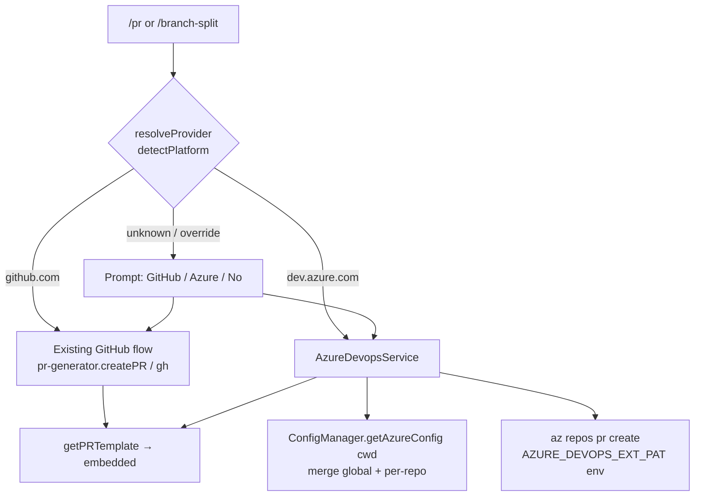

# Azure DevOps Provider Configuration — Design

**Spec**: `.specs/features/git-provider-config/spec.md`
**Status**: Draft

---

## Architecture Overview

The PR commands gain a thin **provider resolution** step in front of creation. GitHub keeps its
existing path untouched. A new `AzureDevopsService` wraps the `az` CLI and owns Azure remote parsing
+ PR creation. `ConfigManagerService` learns to read/merge an Azure config from two layers (global
`~/.cast/config.yaml` + per-repo `.cast/config.yaml`).



Resolution rule (AZ-06/07): `detectPlatform()` → `github` runs GitHub flow with **no new prompt**;
`azure` runs Azure flow; `gitlab`/`bitbucket`/`unknown` keep today's "copy description" behaviour,
but offer the GitHub/Azure/No prompt when the user explicitly wants to pick (override flag / unknown).

---

## Code Reuse Analysis

### Existing Components to Leverage

| Component | Location | How to Use |
| --------- | -------- | ---------- |
| `detectPlatform()` | `git/services/pr-generator.service.ts:151` | Provider resolution — already maps remote → `github\|azure\|…`. |
| `getPRTemplate()` / `buildDefaultTemplate()` | `pr-generator.service.ts:475` | Reuse embedded template; **delete** `prTemplatePath` + file read. |
| `generatePRDescription()` | `pr-generator.service.ts:248` | Same LLM body generation feeds both providers. |
| ConfigManager load/merge/save | `config/services/config-manager.service.ts` | Mirror `setRemoteInteractive`/`setPlatformConfig` pattern for Azure; add per-repo layer. |
| `inputWithEsc` / `confirmWithEsc` / `selectWithEsc` | `repl/utils/prompts-with-esc.ts` | Build the Azure settings prompts (same as `setRemoteInteractive`). |
| `runInquirerFlow` + menu switch | `config-commands.service.ts:106` | Add menu entry + handler, identical wiring to Remote UI. |
| `.gitignore` ensure pattern | `branch-split.service.ts:484` `ensureGitignored` | Same approach to ignore `.cast/`. |
| `createPullRequests()` stack loop | `branch-split.service.ts:506` | Branch by provider inside the per-entry loop. |

### Integration Points

| System | Integration Method |
| ------ | ------------------ |
| `az` CLI | `execFileSync('az', [...], { env: { ...process.env, AZURE_DEVOPS_EXT_PAT: pat } })`. PAT never in argv. |
| Per-repo config | New `.cast/config.yaml` at repo root, read with the same `js-yaml` already imported in ConfigManager. |
| GitHub | Unchanged — no new calls, no config reads on the GitHub path. |

---

## Components

### AzureDevopsService (new)

- **Purpose**: Own everything Azure-DevOps: remote parsing, `az` availability, single + stacked PR creation.
- **Location**: `src/modules/git/services/azure-devops.service.ts`
- **Interfaces**:
  - `isAzAvailable(): boolean` — mirrors the `which gh` check.
  - `parseAzureRemote(remoteUrl: string): { organizationUrl?: string; project?: string; repository?: string }` — handles `dev.azure.com/{org}/{project}/_git/{repo}`, `ssh.dev.azure.com:v3/{org}/{project}/{repo}`, `{org}.visualstudio.com/{project}/_git/{repo}`.
  - `createPr(input: AzurePrInput): AzurePrResult` — runs `az repos pr create`, returns `{ success, url?, error? }`.
  - `createStackedPrs(manifest: BranchSplitManifest, cfg: ResolvedAzureConfig, cwd: string): { created; failed; umbrellaUrl? }`.
- **Dependencies**: `child_process`, resolved Azure config (from ConfigManager).
- **Reuses**: error-surfacing + URL-parse style from `pr-generator.createPR`; stack iteration shape from `branch-split.createPullRequests`.

### ConfigManagerService (extend)

- **Purpose**: Store/merge Azure config across global + per-repo layers; mask PAT.
- **Location**: `src/modules/config/services/config-manager.service.ts`
- **Interfaces**:
  - `getAzureConfig(cwd?: string): ResolvedAzureConfig | undefined` — merges global `azureDevops` with `<cwd>/.cast/config.yaml` (per-repo wins).
  - `setAzureGlobalConfig(cfg: AzureDevopsGlobalConfig): Promise<void>` — writes `~/.cast/config.yaml`.
  - `setAzureRepoConfig(cwd: string, cfg: AzureDevopsRepoConfig): Promise<void>` — writes/creates `<cwd>/.cast/config.yaml`, ensures `.cast/` gitignored.
  - `maskSecret(value?: string): string` — `••••` + last 4.
- **Dependencies**: `fs/promises`, `js-yaml`, `path` (all already imported).
- **Reuses**: `mergeWithDefaults`/`normalizePlatformConfig` pattern; `saveConfig`.

### GitCommandsService (extend)

- **Purpose**: Route `/pr` and `/branch-split` to the right provider; prompt only when needed.
- **Location**: `src/modules/repl/services/commands/git-commands.service.ts`
- **Interfaces** (private helpers):
  - `resolveProvider(opts?): 'github' | 'azure' | 'none'` — uses `detectPlatform()`; prompts on ambiguous/override.
  - `cmdPr` (edit): after body generation, branch to existing GitHub block or new Azure block.
  - `cmdBranchSplit` (edit): provider-aware open step.
- **Dependencies**: `AzureDevopsService`, `ConfigManagerService`, existing `PrGeneratorService`, `BranchSplitService`.
- **Reuses**: existing GitHub branches verbatim; `askChoice` for the GitHub/Azure/No prompt.

### ConfigCommandsService (extend)

- **Purpose**: "Configure Azure DevOps" menu entry + prompt flow + masked display.
- **Location**: `src/modules/config/services/config-commands.service.ts`
- **Interfaces**: `setAzureInteractive(): Promise<void>` (mirrors `setRemoteInteractive`); new `case 'a'` in `showConfigMenu`; Azure section in `showConfig` (PAT masked).
- **Reuses**: `inputWithEsc`/`confirmWithEsc`, `runInquirerFlow`, `header`, validation pattern.

### InitConfigService (extend, P3)

- **Purpose**: Optional Azure step in the full wizard.
- **Location**: `src/modules/config/services/init-config.service.ts`
- **Reuses**: `setAzureInteractive` logic (shared helper).

---

## Data Models

```typescript
// config.types.ts — additions
export interface AzureDevopsGlobalConfig {
  pat: string;                 // required; via AZURE_DEVOPS_EXT_PAT
  organizationUrl: string;     // required; --organization
  project: string;             // required; --project
  reviewers?: string[];        // --required-reviewers
}

export interface AzureDevopsRepoConfig {
  repository?: string;         // --repository; default from remote
  targetBranch?: string;       // --target-branch; default = repo default branch
}

// Merged view used by AzureDevopsService
export interface ResolvedAzureConfig
  extends AzureDevopsGlobalConfig, AzureDevopsRepoConfig {}

export interface CastConfig {
  // ...existing...
  azureDevops?: AzureDevopsGlobalConfig;   // global layer
}

// Per-repo .cast/config.yaml (separate file)
interface RepoCastConfig {
  azureDevops?: AzureDevopsRepoConfig;
}
```

```typescript
// azure-devops.service.ts
export interface AzurePrInput {
  organizationUrl: string;
  project: string;
  repository: string;
  sourceBranch: string;
  targetBranch?: string;
  title: string;
  description: string;
  reviewers?: string[];
  pat: string;
}
export interface AzurePrResult { success: boolean; url?: string; error?: string; }
```

**Relationships**: `ResolvedAzureConfig` = global `AzureDevopsGlobalConfig` ⊕ per-repo `AzureDevopsRepoConfig` (per-repo wins) ⊕ remote-parsed defaults (lowest precedence for `repository`/org/project).

---

## Provider Resolution Logic (AZ-06/07/08)

```
platform = prGenerator.detectPlatform().platform
switch platform:
  github            -> GitHub flow (unchanged, no prompt)
  azure             -> azureCfg = getAzureConfig(cwd)
                       if !azureCfg or missing required -> warn "run /settings → Configure Azure DevOps", stop
                       else Azure flow
  gitlab|bitbucket  -> today's copy-description behaviour
  unknown           -> prompt "Open PR on: GitHub / Azure / No"
```

`az repos pr create` invocation:

```
az repos pr create
  --organization <organizationUrl>
  --project <project>
  --repository <repository>
  --source-branch <currentBranch>
  [--target-branch <targetBranch>]
  --title <title>
  --description <description...>      # body lines
  [--required-reviewers <r1> <r2>]
  --output json                       # parse .pullRequestId / .url
env: AZURE_DEVOPS_EXT_PAT=<pat>
```

URL: Azure `--output json` returns `pullRequestId`; construct
`<organizationUrl>/<project>/_git/<repository>/pullrequest/<id>` (or use returned `url` if present).

---

## Error Handling Strategy

| Scenario | Handling | User sees |
| -------- | -------- | --------- |
| `az` not installed | `isAzAvailable()` false → skip create | "Azure CLI (az) not found. Install from https://aka.ms/azure-cli", description shown |
| Azure remote but no config | resolveProvider stops before create | "Configure Azure first: /settings → Configure Azure DevOps" |
| Missing required field on save | validate in `setAzureInteractive` | "Organization URL is required" (per field) |
| `az` create fails (auth/target) | capture stderr, surface verbatim | raw `az` error, description preserved |
| PAT rendered anywhere | `maskSecret()` on all display paths | `••••1234` |
| Invalid target branch | `az` error surfaces | raw error, no PR |
| Per-repo file write in non-repo dir | guard: only write if `.git` resolvable | "Not a git repo — repository/target are per-repo settings" |

---

## Tech Decisions (non-obvious)

| Decision | Choice | Rationale |
| -------- | ------ | --------- |
| Azure transport | `az` CLI (not raw REST) | Mirrors existing `gh` dependency; no token-in-URL, less surface; `az` handles API versions. |
| PAT delivery | `AZURE_DEVOPS_EXT_PAT` env var | Never appears in argv/process list; standard for `az devops`. |
| Per-repo store | separate `.cast/config.yaml` (not the global file) | Target/repo are repo-specific; keeps global file portable; gitignored like `.branches/`. |
| New service vs extend pr-generator | new `AzureDevopsService` | Keeps GitHub path untouched (spec: "unchanged"); single responsibility. |
| Template | always embedded | Spec decision; removes machine-local path that would also break Azure bodies. |
| GitHub config | none added | Spec: GitHub stays as-is. |

---

## Open Questions

- None blocking. Azure remote SSH/HTTPS parsing variants are covered in `parseAzureRemote`; if a form is unrecognised the user can still fill `repository`/`organizationUrl` in `/settings`.
